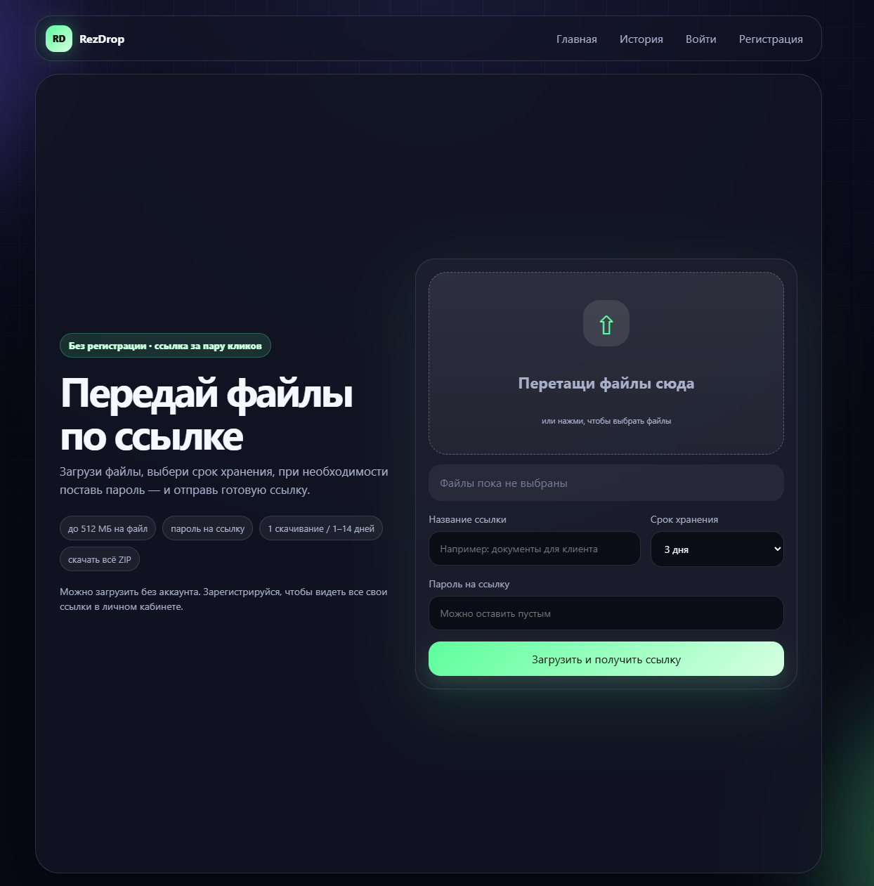
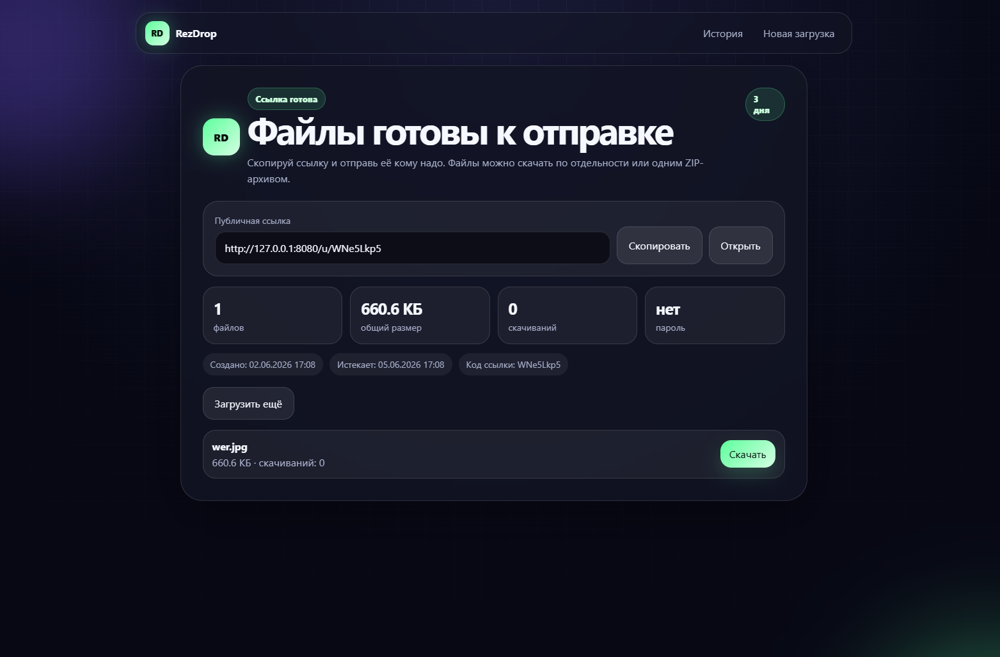
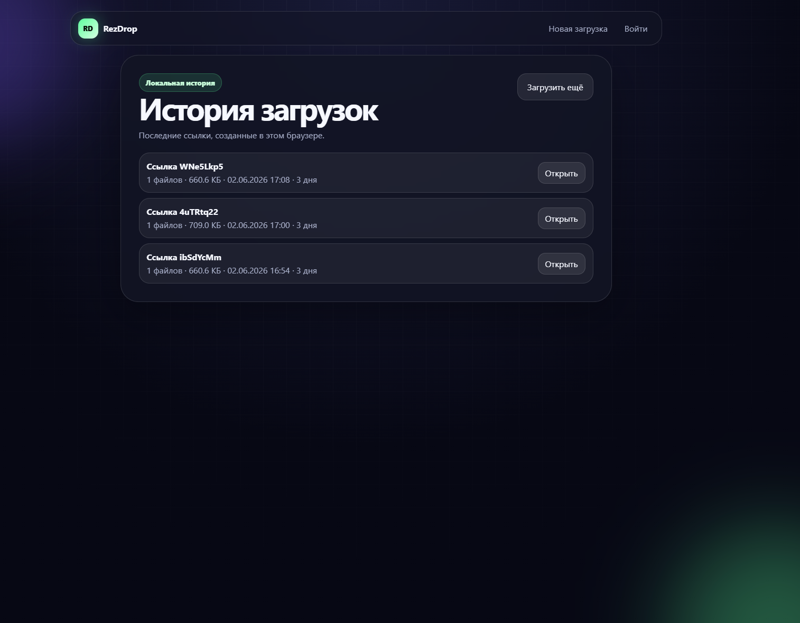
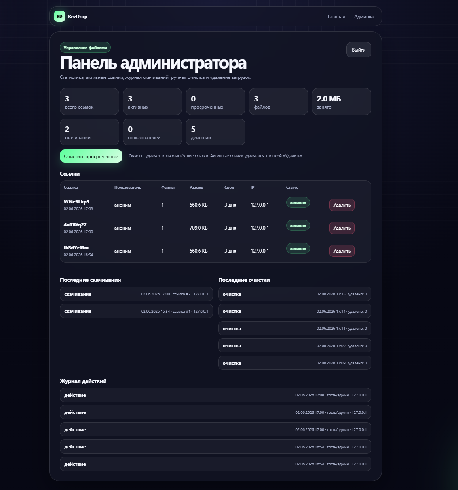

# RezDrop

RezDrop — небольшой файловый сервис на FastAPI.

Он позволяет загрузить один или несколько файлов, получить короткую ссылку, задать срок хранения и при необходимости закрыть доступ паролем.

Проект можно запустить локально, проверить основные сценарии и дорабатывать дальше.

## Что умеет

- загружать один или несколько файлов через web-страницу;
- показывать прогресс загрузки;
- создавать короткую ссылку вида `/u/<code>`;
- задавать срок хранения: 1 скачивание, 1 день, 3 дня, 7 дней или 14 дней;
- ставить пароль на ссылку;
- скачивать отдельный файл или весь набор ZIP-архивом;
- регистрировать пользователей;
- показывать личный кабинет “Мои загрузки”;
- показывать гостевую историю загрузок в текущем браузере;
- открывать админку со статистикой и очисткой просроченных ссылок;
- хранить метаданные в базе;
- хранить файлы локально или через MinIO/S3;
- запускаться локально на SQLite или через Docker с PostgreSQL и MinIO.

## Скриншоты

### Главная страница



### Результат загрузки



### История загрузок



### Панель администратора



## Стек

- Python
- FastAPI
- Jinja2
- SQLAlchemy
- Alembic
- SQLite для быстрого локального запуска
- PostgreSQL для Docker/VPS-варианта
- MinIO/S3-совместимое хранилище
- Docker Compose
- Pytest
- GitHub Actions

## Быстрый запуск на Windows

Самый простой вариант для проверки проекта:

```bat
start_windows.bat
```

Скрипт создаст локальный `.env`, подготовит виртуальное окружение, установит зависимости и запустит приложение на SQLite и локальном хранилище.

После запуска открыть:

```text
http://127.0.0.1:8080
```

Админка:

```text
http://127.0.0.1:8080/admin
```

Данные для входа в админку берутся из `.env`. При первом запуске Windows-скрипт создаёт этот файл из `.env.local.example`.

## Запуск через Docker

1. Создать `.env`:

```bash
cp .env.example .env
```

2. Поменять секреты в `.env`:

```env
APP_SECRET_KEY=<set long random secret key>
ADMIN_PASSWORD=<set strong admin password>
S3_SECRET_KEY=<set strong storage password>
ALLOWED_HOSTS=example.com
COOKIE_SECURE=true
```

3. Запустить:

```bash
docker compose up --build
```

Будет поднято:

- приложение: `http://127.0.0.1:8080`
- PostgreSQL: `127.0.0.1:5432`
- MinIO API: `http://127.0.0.1:9000`
- MinIO Console: `http://127.0.0.1:9001`

## Переменные окружения

Основные настройки лежат в `.env.example`.

Для быстрого локального запуска используется `.env.local.example`:

```env
DATABASE_URL=sqlite:///./rezdrop_dev.db
STORAGE_BACKEND=local
```

Для Docker-режима используется PostgreSQL и MinIO/S3:

```env
DATABASE_URL=<set database connection string on server>
STORAGE_BACKEND=s3
S3_ENDPOINT_URL=http://minio:9000
```

## Безопасность

В проекте есть базовые вещи, которые полезны для такого сервиса:

- CSRF-защита для браузерных POST-форм;
- security headers;
- настройка secure cookies для HTTPS;
- trusted hosts через `ALLOWED_HOSTS`;
- проверка слабых секретов при `APP_ENV=production`;
- возможность использовать `ADMIN_PASSWORD_HASH` вместо обычного пароля в `.env`;
- простая проверка файлов: блок опасных расширений и тестовой сигнатуры EICAR;
- ограничения по IP, размеру и количеству файлов;
- Docker-контейнер приложения запускается не от root.

Подробнее: `SECURITY.md`.

## API

В локальном режиме документация API доступна по адресу:

```text
/docs
```

Полезные endpoints:

```text
GET  /health
GET  /api/status
GET  /api/me
POST /api/upload
POST /cleanup
```

## Тесты

```bash
pip install -r requirements-dev.txt
pytest -q
```

В CI запускается проверка компиляции и тесты.

## Что можно доработать

- подключить ClamAV вместо простой проверки;
- вынести rate-limit в Redis;
- добавить отдельный worker для очистки файлов;
- добавить email-подтверждение;
- расширить тесты;
- добавить Nginx + HTTPS для VPS.

## Статус проекта

Проект подходит для локального запуска и дальнейшей доработки.  
Для настоящего продакшена его ещё нужно усиливать: безопасность, хранение файлов, мониторинг, лимиты и деплой.
